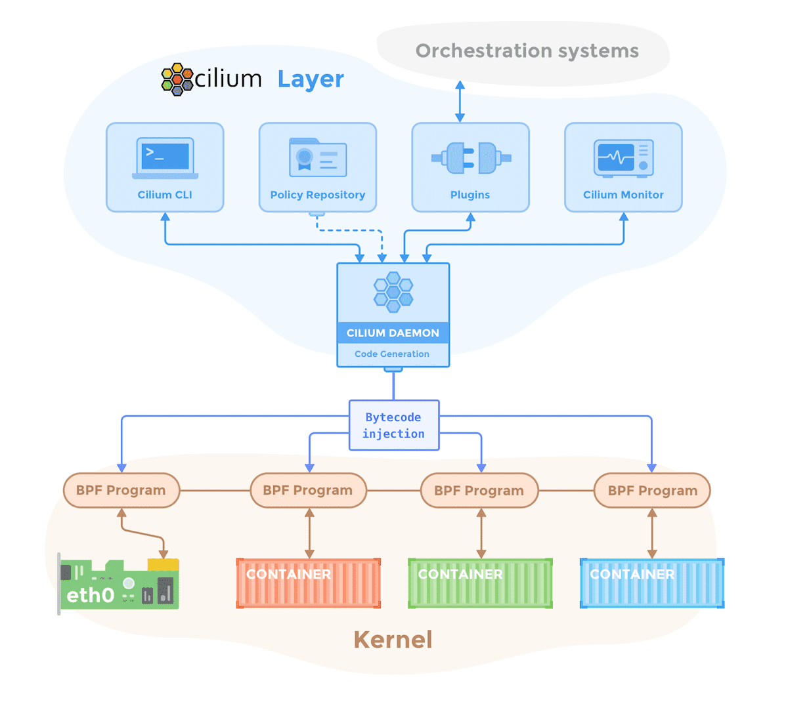
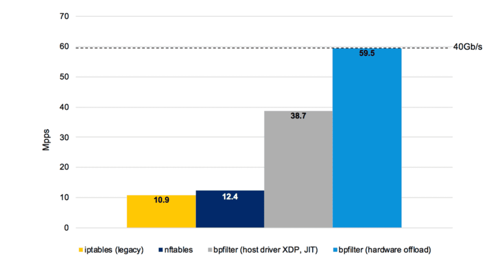
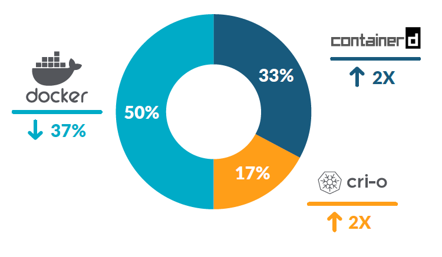
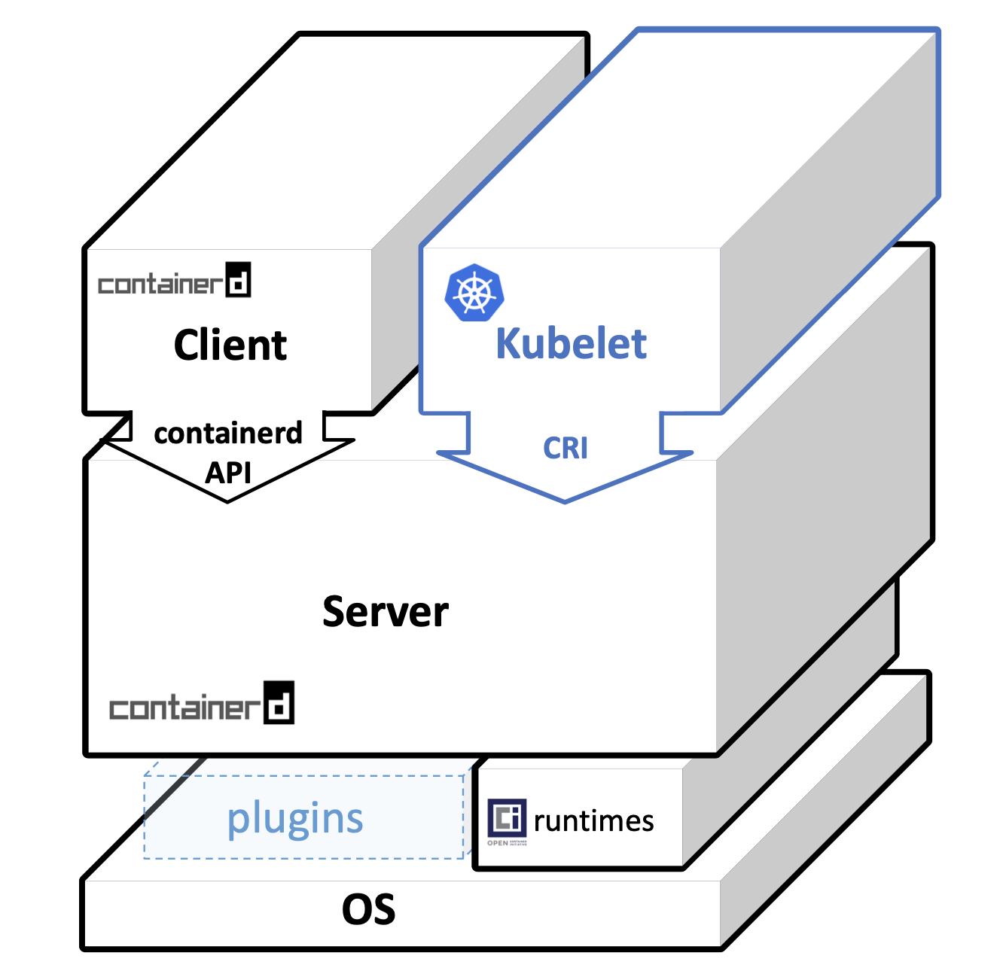
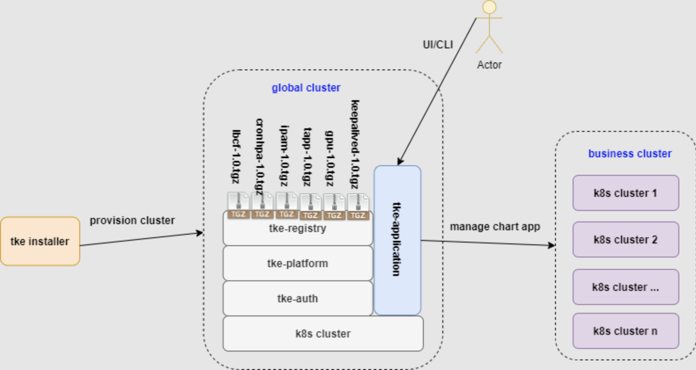
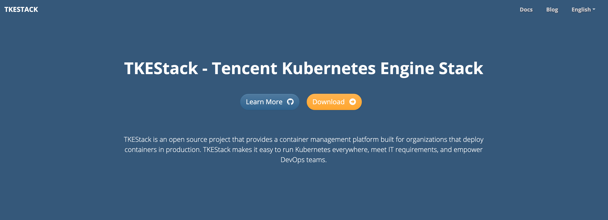

#  TKEStack 1.8 新特性预览

## 支持Cilium作为Kubernetes容器网络插件

自1.7.0版本起，TKEStack集成了Cilium，它拓展了TKEStack集群网络的技术栈，用户可以根据网络环境和场景需求，选择自研网络插件[Galaxy](https://github.com/tkestack/galaxy)或[Cilium](https://github.com/cilium/cilium)作为业务集群的容器网络插件。在1.8的预览版中，用户可以通过集群配置页面设置容器网络组件，指定参数，并支持 Cilium Overlay Network 和 Cilium Underlay Network 自动化配置。

Cilium是一款在Apache-2.0 License分发的开源软件，用于管理和保护以Kubernetes为代表的容器管理平台部署的应用服务之间的网络连接。Cilium的基础是一种名为eBPF的新技术，它支持强大的安全可视化功能，并可以在Linux中动态插入控制逻辑程序。由于eBPF是运行在Linux内核中的，所以在更新应用Cilium安全策略时不需要对应用或容器配置进行任何修改。下图是Cilium的架构图[1]：

借助eBPF，Cilium可以利用很多Linux内核的新技术大大提升集群的网络性能。例如Linux社区为替代iptables而启动的bpfilter项目[2]可以有效解决网络瓶颈问题。对于网络性能要求较高的使用场景，TKEStack建议用户选择使用Cilium的网络方案：
-  Cilium Overlay Network ： 基于宿主机物理网络环境的模型，容器与现有网络可以直接互通，不需要经过封包解包或是 NAT，其性能最好，但是其普适性较差，且受宿主机网络架构的制约，比如 MAC 地址可能不够用。 
-  Cilium Underlay Network: 通用的虚拟化网络模型，不依赖于宿主机底层网络架构，可以适应任何的应用场景，方便快速体验。但是性能较差，因为在原有网络的基础上叠加了一层 Overlay 网络，封包解包或者 NAT ，对网络性能都是有一定损耗的,  但性能优于其他网络组件

下图是关于bpfilter的性能测试数据[3]：

## 支持Containerd作为集群容器运行时

去年年末，Kubernetes社区宣布预计最早将在2021年晚些时候发布的1.23版本中废弃dockershim[4]，这意味着未来的Kubernetes将不再支持以Docker作为容器运行时。

TKEStack社区经过研讨调研后，决定使用Containerd作为未来替代Docker的容器运行时。Containerd是除Docker外当下最为成熟稳定，并被广泛接受的容器运行时，下图是2021年年初关于容器运行时使用率相关的调查统计[5]：

Containerd的架构是client-server架构，支持runc、Kata Container等多种底层运行时，同时又有很高的扩展性，下图为Containerd的整体架构图[6]：

作为过渡时期，如果用户选择的Kubernetes版本依旧支持dockershim，TKEStack将允许用户在创建集群时决定选择Docker还是Containerd作为容器运行时，并提供文档，帮助用户将存量集群的runtime从Docke迁移到Containerd，未来，TKEStack会移除掉docker的依赖，全面兼容社区的CRI标准模型，并将containerd作为默认的runtime。

## 面向应用的容器平台

TKEStack全面实践面向应用的容器平台，并重新定义了平台功能组件和addon功能组件，全面利用`helm chart`机制，将功能组件打包成chart,  实现k8s+charts的融合架构。 功能组件和平台的生命周期管理解耦,  并提供framework实现平台功能组件和用户功能组件全生命周期管理。在即将发布的1.8版本中，TKEStack将支持在`Cluster`对象中定义基于Helm chart打包的应用，允许用户根据自己的业务需求，在创建集群时灵活优雅地剪裁一些默认应用服务，或是增添一些用户自定义的的应用。下图展示了整体的设计架构：

集群应用服务定义声明运行用户在两个阶段进行：

其一是在集群创建之前，用户可以在集群创建之前便可以给出希望在该集群上创建的应用，平台在创建集群成功之后会自动将用户提前定义好的应用服务自动部署到集群上。

其二是在集群创建之后，用户在创建集群之后也可以通过编辑`Cluster`对象增删改应用信息，平台将自动增加、删除或者修改对应的应用。

这一功能将支持用户以云原生的方式更加方便灵活地设计自己的业务模型，减少了很多重复性工作，把更多的精力集中到更值得关注的业务上。同时，借助强大的Helm chart，用户可以很方便地打包维护自己的应用服务，并通过`values.yaml`进行配置管理以适应各种业务场景。

## 全新的TKEStack社区网站

为了更好的持续维护TKEStack社区的文档，同时方便用户及开发人员们分享关于TKEStack及云原生相关的技术知识，TKEStack在2021年6月开放了新的社区网站 https://tkestack.github.io/web/zh/ 。

参考云原生诸多项目维护经营网站的方案，TKEStack采用了Hugo的Docsy主题来建设和维护网站，当前网站开放了`Docs`和`Blog`两个模块，后续将逐步开放更多的模块和内容。其中`Blog`模块已经提交了第一份文章【腾讯开源容器云平台 TKEStack 介绍】https://tkestack.github.io/web/zh/blog/2021/06/09/tkestack-indtroduction-2021/ ，文章中介绍了TKEStack的愿景目标，整体架构和能力特性。

如果有TKEStack的用户和开发者们希望给我们的社区网站提一些建议，或者分享一些经验，可以参考我们的首篇文章PR，https://github.com/tkestack/web/pull/9 ，以及Docsy主题官方的添加文章指引，https://www.docsy.dev/docs/adding-content/content/#adding-docs-and-blog-posts ，到我们网站的github仓库 https://github.com/tkestack/web 提交。TKEStack社区将会因为你的贡献而变得更好！

## 参考资料

[1] Cilium 1.0: Bringing the BPF Revolution to Kubernetes Networking and Security [https://cilium.io/blog/2018/04/24/cilium-10]

[2] BPF comes to firewalls[https://lwn.net/Articles/747551/]

[3] Why is the kernel community replacing iptables with BPF? [https://cilium.io/blog/2018/04/17/why-is-the-kernel-community-replacing-iptables]

[4] Dockershim Deprecation FAQ [https://kubernetes.io/blog/2020/12/02/dockershim-faq/]

[5] Sysdig 2021 container security and usage report: Shifting left is not enough [https://sysdig.com/blog/sysdig-2021-container-security-usage-report/]

[6] Introduction and Deep Dive Into Containerd [https://static.sched.com/hosted_files/kccnceu2021/d3/containerd-KubeConEU2021.pdf]
