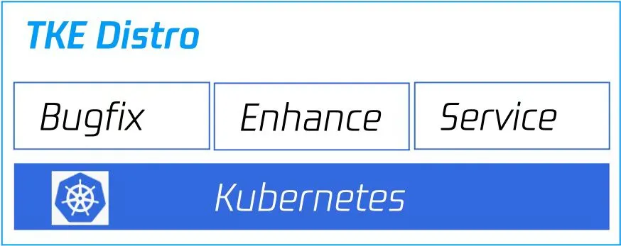
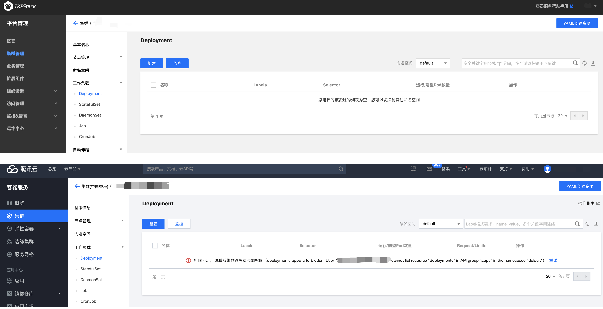

# TKEStack 容器混合云能力介绍（1）：统一基石

## 前言

随着云计算及云原生技术在各个领域内的逐步普及，基于 Kubernetes 的混合云相关概念和项目越来越受到人们的关注。以混合云形态部署企业的业务服务，在理论上可以最大化利用现有资源，形成差异互补和成本优化。以云计算及云原生技术作为基础设施的企业大致可以分为两类：一种是已经有存量 IDC 的企业，一种是业务全面使用公有云的企业。从已经有存量 IDC 的企业角度考虑，混合云可以最大化利用现有IDC资源的同时，既可以发挥 IDC 的灵活安全能力，也可以享受到公有云的高性价比优势；从业务全面使用公有云的企业角度考虑，混合云在为企业提供不同云服务商的差异能力的同时，也减少了企业绑定单一云服务商的潜在风险。

尽管混合云的愿景是美好的，但走向这愿景的路并非简单。本文将着重介绍 TKEStack 提供混合云能力的道路上，在统一操作系统版本、 Kubernetes 版本、容器运行时和用户交互上遇到的困境与解决方案。

## 不统一带来的问题

### 安全风险

在 Linux 和 Kubernetes 受到广泛关注的今天，其安全问题的影响范围也越来越大。例如 2018 年爆出的特斯拉公司计算基础设施被黑客入侵用来挖矿的事件[1]，就是因为特斯拉在亚马逊 AWS 上的 Kubernetes 容器集群访问权限没有得到妥善保护，导致存储在S3网络存储桶上的一些敏感技术数据，例如遥测技术，被窃取。

根据 Palo Alto Networks 公司 Unit 42 团队的研究报告，在 2018 年 1 月至 2019 年 6 月之间，有2万多个基于 Kubernetes 的容器平台被暴露，下图为这些被暴露平台在全球范围内的统计数据[2]：

该报告中还统计了各云服务提供商平台上发现的漏洞：亚马逊 AWS 平台上被发现超过 2900 万个漏洞，谷歌云发现的漏洞数量接近 400 万，微软 Azure 发现了 170 万左右漏洞。

这些漏洞分布在各种操作系统版本、Kubernetes 发行版本、容器运行时乃至用户交互的前端相关代码中。这些关键要素的不统一在客观上为这些安全漏洞提供了温床。

### 运维成本

不统一也会使得用户的运维成本变得很高。例如当前 TKEStack 在混合云场景主推的网络方案 Cilium，其很多特性都要求在特定的内核版本以上才支持开启，下图是 Cilium 不同特性对内核版本要求的统计[3]：

而 Kubernetes 版本尽管声明 patch 版本上下兼容，但实际上在各版本间 API 资源对象的转换方面可能存在兼容问题。例如 TKEStack 在升级 Kubernetes API 版本时就发现 `url.Values` 隐式自动转换为 Kubernetes 对象已经被废弃[4]，导致很多接口无法正常使用。

随着业务的运行时间拉长和不断迭代，因为操作系统、Kubernetes、容器运行时和 UI 的不统一造成的运维成本，也会随着时间的推移越堆越高。

## TKEStack 社区为统一操作系统和 Kubernetes 版本做出的努力

### 推荐使用 TencentOS Server

TencentOS Server 又名 Tencent Linux，简称 Tlinux 是腾讯针对云场景研发的 Linux 操作系统，提供了专门的功能特性和性能优化，为云服务器实例中的应用程序提供高性能，且更加安全可靠的运行环境[5]。

作为一个Linux发行版，Tlinux拥有以下优势：

1. 内核定制，基于内核社区长期支持的4.14.105版本定制而成，增加适用于云场景的新特性、改进内核性能并修复重大缺陷。

2. 容器支持，针对容器场景进行优化，提供了隔离增强和性能优化特性：meminfo、vmstat、cpuinfo、stat、loadavg, uptime, diskstats。

3. 性能优化，计算、存储和网络子系统均经过优化，包括：优化 xfs 内存分配，解决 xfs kmem_alloc 分配失败告警优化网络收包大内存分配问题，解决 UDP 包量大时，占据过多内存问题限制系统 page cache 占用内存比例，从而避免内存不足影响业务的性能或者 OOM。

4. 缺陷支持，提供操作系统崩溃后的 kdump 内核转储能力提供内核的热补丁升级能力。

5. 安全更新，会定期进行更新，增强安全性及功能。

6. 其他特性，离线调度算法(BT)、进程防gdb、ARM64热补丁、pagecache limit等。

在混合云场景下 TKEStack 推荐使用 TencentOS Server 作为底层的操作系统，安全高效并提供了强大的云原生能力，关于 TencentOS Server 可以到项目网站 https://github.com/Tencent/TencentOS-kernel 以了解更多内容。

### 引入 TKE 发行版到 TKEStack

长久以来，TKEStack 只提供了原生 Kubernetes 给用户使用，这使得 TKEStack 所能提供给用户的能力常常受到原生 Kubernetes 的现有能力的限制。为了打破这一现状，TKEStack 在前不久发布的 1.7 版本引入了由腾讯云 TKE 发布的 Kubernetes 发行版本，TKE 发行版（TKE Kubernetes Distro）。TKE 发行版在保证兼容性的基础上，对 K8s 进行了扩展，并且与腾讯云 TKE 服务保持版本一致。用户可以在自己的 IDC 或者混合云上部署 TKE 发行版，使用已有企业用户大规模验证的可靠安全的 Kubernetes 服务[6]。

相比原生的 Kubernetes 版本，TKE 发行版优势有下面几项：

1. 大规模生产集群验证，TKE 发行版提供与腾讯云 TKE 相同的可安装版本和开源代码，功能和稳定性经过大量企业用户、公有云及自研云锤炼。用户可以使用提供的源代码和编译工具进行构建和部署。

2. 无缝集成公有云 TKE，TKE 发行版可支持用户在自建或者托管机房，物理机或者虚机上，运行与腾讯云 TKE 完全一致的 K8s 服务。并且可以无缝与腾讯云 TKE 集成，组建混合云集群。

3. 更长支持周期，TKE 发行版的支持周期比社区版更长。在社区版停止支持后，TKE 发行版将继续得到支持，包括重要问题以及安全漏洞的修复。

4. 更多实用能力增强，TKE 发行版结合腾讯自身业务特点和经验，针对部分场景（弹性扩容、离在线混部、资源隔离等）实现了能力增强。并且 TKE 发行版紧跟社区趋势，主导或深度参与社区 KEP 设计与实现。对于有实用价值 KEP 会先于社区支持，让用户提前享受到云原生技术进步。

关于 TKE 发行版的更多信息可以访问 https://github.com/tkestack/tke-k8s-distro 以进一步了解。

在 1.7 版本中 TKEStack 支持 TKE 发行版本和原生两种 Kubernetes 发行版本，由于 TKE 发行版完全兼容原生  Kubernetes 发行版本，在后续的迭代中 TKEStack 将朝着只携带 TKE 发行版的方向逐步前进。

### 使用 Containerd 作为容器运行时

2020 年年末，Kubernetes社区宣布预计最早将在2021年晚些时候发布的 1.23 版本中废弃dockershim[7]，这意味着未来的 Kubernetes 将不再支持以 Docker 作为容器运行时。

TKEStack 社区经过研讨调研后，决定使用和腾讯公有云 TKE 一致的 Containerd 作为未来替代 Docker 的容器运行时。Containerd 是除 Docker 外当下最为成熟稳定，并被广泛接受的容器运行时，下图是 2021 年年初关于容器运行时使用率相关的调查统计[8]：

Containerd 的架构是 client-server 架构，支持 runc、Kata Container 等多种底层运行时，同时又有很高的扩展性，下图为 Containerd 的整体架构图[9]：

作为过渡时期，如果用户选择的 Kubernetes 版本依旧支持 dockershim，TKEStack 将允许用户在创建集群时决定选择 Docker 还是 Containerd 作为容器运行时，并提供文档，帮助用户将存量集群的 runtime 从 Docker 迁移到 Containerd。未来，TKEStack会移除掉 Docker 的依赖，全面兼容社区的 CRI 标准模型，并将 Containerd 作为默认的 runtime 与公有云 TKE 保持统一。

### 风格统一的用户交互

统一的交互风格可以大大减少用户的学习成本和心智负担。TKEStack 与腾讯公有云 TKE 产品采用了相同的交互风格，用户只需要适应了其中一个的交互习惯，就可以几乎零学习成本的操作使用另外一款产品。下图展示了 TKEStack 和腾讯公有云 TKE 产品的用户前端交互页面：

TKEStack 和腾讯公有云 TKE 产品上有着很多相同的概念，针对这些概念的视图展示逻辑也是一致的。在混合云场景下，这种一致性将产生积极的化学反应，对用户非常友好，并减轻了维护上的成本。

交互的统一不仅仅对用户有很多好处，对后续 TKEStack 的产品设计，后台架构搭建及能力实现上都有着积极的作用，而这种积极作用会为 TKEStack 加速布局混合云领域提供有力的支持。

## 总结

正所谓工欲善其事，必先利其器，只有统一巩固一个强大稳定的平台基石，TKEStack 才会在提供混合云能力的道路上行驶的更加平稳。后续我们会在该系列中介绍更多关于 TKEStack 的混合云能力，敬请大家期待。

最后欢迎大家到 TKEStack 的项目仓库 https://github.com/tkestack/tke 提出建议贡献力量，大家的支持将会令 TKEStack 项目变得更好！

## 参考资料

[1] Lessons from the Cryptojacking Attack at Tesla [https://redlock.io/blog/cryptojacking-tesla]

[2] Cloudy with a Chance of Entropy [https://www.paloaltonetworks.com/resources/research/unit42-cloud-with-a-chance-of-entropy]

[3] Required Kernel Versions for Advanced Features [https://docs.cilium.io/en/v1.10/operations/system_requirements/#required-kernel-versions-for-advanced-features]

[4] Can no longer call DecodeParameters with url.Values in 1.19.0 client-go [https://github.com/kubernetes/kubernetes/issues/94688]

[5] 腾讯TencentOS 十年云原生的迭代演进之路 [https://mp.weixin.qq.com/s/Cbck85WmivAW0mtMYdeEIw]

[6] 腾讯云云原生混合云-TKE发行版 [https://mp.weixin.qq.com/s/d7ubPXwtTw8JsFIHp-JXEg]

[7] Dockershim Deprecation FAQ [https://kubernetes.io/blog/2020/12/02/dockershim-faq/]

[8] Sysdig 2021 container security and usage report: Shifting left is not enough [https://sysdig.com/blog/sysdig-2021-container-security-usage-report/]

[9] Introduction and Deep Dive Into Containerd [https://static.sched.com/hosted_files/kccnceu2021/d3/containerd-KubeConEU2021.pdf]