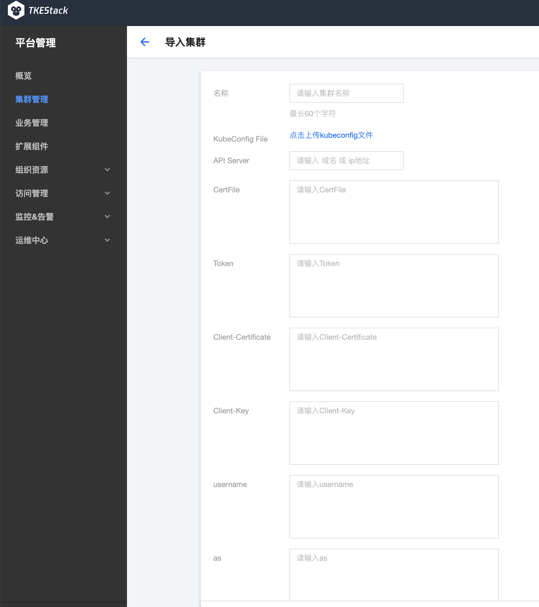
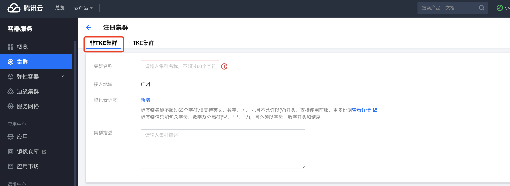
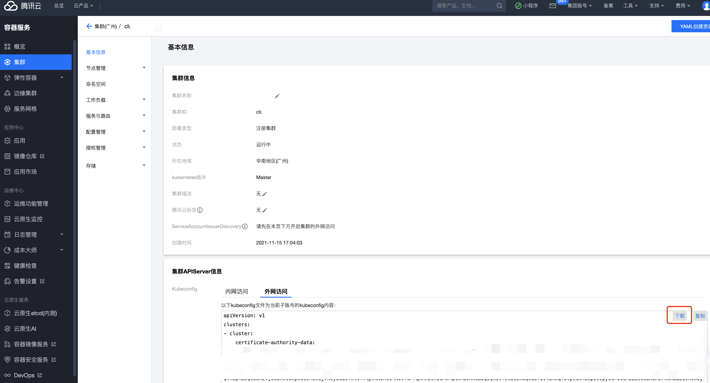
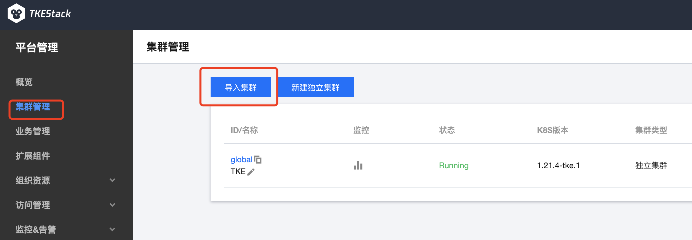
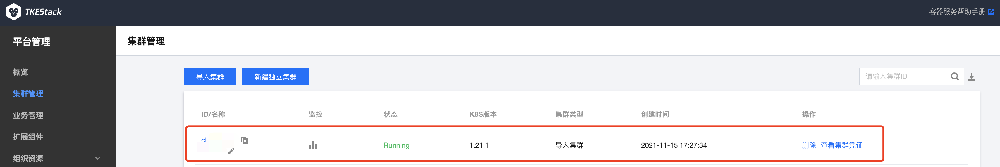

**Author**: LeoRyu

_TKEStack 提供了多集群管理能力，其中导入集群功能通过推送模式由 TKEStack 管控集群（global cluster）直连第三方集群的 api-server 进而统一纳管部署在 IDC，公有云或边缘的第三方集群。 但在实际生产环境中， 管控集群和第三方集群之间的直连往往会出现很多阻碍：或是不在同一个二层网络下，或是第三方集群在防火墙/NAT之后，或是第三方集群在网络策略上不允许有入站网络传输，在这些场景下, TKEStack难以直连第三方集群 api-server, 导入集群的能力无法发挥。针对这一问题本文将介绍 TKEStack 如何借助腾讯云原生分布式云中心注册集群的功能打破网络边界的限制，将网络环境相对隔离的集群纳入到 TKEStack 的管控面，进行统一管控。_

## TKEStack 的导入集群功能

开源版 TKEStack 的集群管理中<sup>[1]</sup>存在两种集群的概念，一种是`独立集群`，另一种是`导入集群`。

其中`独立集群`需要用户提供可被 TKEStack 访问的 Linux 机器的访问凭证，TKEStack 将以用户提供的机器作为基础设施，从 0 搭建可被 TKEStack 管控的 K8s 集群。


`导入集群`则是将用户的现存集群纳入到 TKEStack 的管控之下，但需要此集群可以被 TKEStack 访问到（无需被导入集群可访问 TKEStack），用户在满足此条件前提下可提供被导入集群的访问凭证，便可将集群纳入到 TKEStack 管控视野内。



但是在现实生产环境中，被导入集群有极大的可能性处于外网无法访问的网络环境中，此时我们可以借助腾讯云的分布式云中心来打通 TKEStack 与被导入集群间的网络边界限制。

## 打破网络边界

云原生分布式云中心（Tencent Kubernetes Engine Distributed Cloud Center，TDCC）<sup>[2]</sup> 是腾讯面向多云多集群场景的应用管理平台，支持用户将云原生化的应用扩展到分布式云，打通公有云、私有云、边缘云的界限，将各种成熟的集群、网络、存储、微服务、运维等公有云产品和服务交付至更接近用户和数据的位置，确保不同云基础设施下拥有一致的控制平面，并且提供可靠性保证和安全合规保证，满足企业用户的多云管理、应用治理、高可用容灾等场景诉求。

下面笔者将演示在家庭网络环境下（可访问公网）使用 kind<sup>[3]</sup> 创建一个 K8s 集群，并借助分布式云中心，将其导入一个私有云网络环境下（可访问公网）的 TKEStack。由于 TKEStack 在 v1.8 release 时云原生分布式云中心还未上线，这里需要我们使用 daily build 版本进行体验，该功能的正式发布则需要等到稍晚些 TKEStack v1.9.0 发布，daily build 版本下载可参考以下命令：

```bash
version=310e18e0d696ee0aa57dfe38655b99726eab9f5c && wget https://tke-release-1251707795.cos.ap-guangzhou.myqcloud.com/tke-installer-linux-amd64-$version.run{,.sha256} && sha256sum --check --status tke-installer-linux-amd64-$version.run.sha256 && chmod +x tke-installer-linux-amd64-$version.run && ./tke-installer-linux-amd64-$version.run
```


### 创建 kind 集群

这里笔者在自己的虚拟机上使用 kind 创建一个集群，首先是安装 kind：

```bash
curl -Lo ./kind https://kind.sigs.k8s.io/dl/v0.11.1/kind-linux-amd64
chmod +x ./kind
mv kind /usr/bin/
```

然后我们执行 kind 的创建集群命令：

```bash
kind create cluster
```

如果不出意外我们将在等待一段时间后得到以下结果：

```bash
Creating cluster "kind" ...
 ✓ Ensuring node image (kindest/node:v1.21.1) 🖼 
 ✓ Preparing nodes 📦  
 ✓ Writing configuration 📜 
 ✓ Starting control-plane 🕹️ 
 ✓ Installing CNI 🔌 
 ✓ Installing StorageClass 💾 
Set kubectl context to "kind-kind"
You can now use your cluster with:

kubectl cluster-info --context kind-kind

Not sure what to do next? 😅  Check out https://kind.sigs.k8s.io/docs/user/quick-start/
```

下面可以使用 kubectl 来确认一下集群是否在正常运行，这里我们就完成了 kind 集群的创建工作。如果你的机器上没有 kubectl 可以参考[Install and Set Up kubectl on Linux
](https://kubernetes.io/docs/tasks/tools/install-kubectl-linux/)进行安装。

### 注册集群到分布式云中心

访问腾讯云的[分布式云中心主页](https://console.cloud.tencent.com/tdcc/cluster)，选择注册集群按钮。


这里由于我们是通过 kind 创建的集群并非 TKE，所以注意选择非 TKE 集群。



注册集群创建成功后改集群将处于等待注册的状态，点击查看注册命令。


由于我们的 kind 集群无法无法通过内外与分布式云中心通信，注意选择外网访问。


根据提示将`agent.yaml`下载下来然后通过 kubectl 部署到 kind 集群：

```bash
kubectl apply -f agent.yaml
```

如果顺利我们将会得到以下反馈：

```bash
namespace/clusternet-system created
serviceaccount/clusternet-agent created
serviceaccount/clusternet-app-deployer created
deployment.apps/clusternet-agent created
clusterrole.rbac.authorization.k8s.io/clusternet:app:deployer created
clusterrolebinding.rbac.authorization.k8s.io/clusternet:app:deployer created
secret/clusternet-agent-cluster-registration created
```

此时可以通过下面的命令确认下 agent 相关 pod 是否正常工作：

```bash
kubectl get pod -n clusternet-system
```

如果正常我们应当会得到类似下面的反馈：

```bash
NAMESPACE            NAME                                         READY   STATUS    RESTARTS   AGE
clusternet-system    clusternet-agent-6754cc97bb-dk6r4            1/1     Running   0          8s
clusternet-system    clusternet-agent-6754cc97bb-sbpzg            1/1     Running   0          8s
clusternet-system    clusternet-agent-6754cc97bb-zfblp            1/1     Running   0          8s
```

再检查分布式云中心首页我们将发现 kind 集群已经成功注册了进来。

### 导入集群到 TKEStack

下面我们将把 kind 集群导入到 TKEStack 中，首先从分布式云中心将集群的访问凭证下载下来。




然后使用此凭证便可将 kind 集群导入到 TKEStack 中。






## 原理

腾讯云分布式云中心的核心功能由 Clusternet<sup>[4]</sup> 提供，该项目已经开源，可以在 https://github.com/clusternet/clusternet 仓库下查看代码。

Clusternet 的核心能力通过`clusternet-hub`和`clusternet-agent`两个组件实现，`clusternet-hub`的角色类似一个电插板，以 aggregated apiserver<sup>[5]</sup> 形式部署在父集群中等待着子集群被接入进来；`clusternet-agent`则在子集群中充当一个派驻信使的角色，一方面将子集群的信息上报给`clusternet-hub`以进行观测，另一方面将从`clusternet-hub`传送来的指令下发给子集群以进行控制。鉴权模式上 Clusternet 复用了子集群的鉴权能力，通过 K8s 的 user impersonation<sup>[6]</sup> 能力将认证信息发送到`clusternet-agent`模拟对应用户进行操作控制。


## 加入我们

在大家的共同努力下 TKEStack 已经演进到 v1.8.x 版本，其中包括了 containerd 支持、cilium 支持、集群应用定义等诸多新功能，欢迎大家到 https://github.com/tkestack/tke/releases 下载体验。同时 v1.9.0 版本的开发工作正在主分支上火热进行中，v1.9.0 版本中除了本文介绍的支持导入分布式云中心集群外，我们会全面升级 TKEStack 的各种依赖，包括 golang 版本、CI 工具版本以及 K8s api 版本等，此外我们还将在 TKEStack 的轻量化减负上做出努力，包括移除 TKE 发行版<sup>[7]</sup>以外的集群版本，删减不常用的 addon 组件等。当下的 TKEStack 正是需要你加入的时候，欢迎大家到项目仓库 https://github.com/tkestack/tke 贡献一份力量！

## 参考资料


[1] TKEStack 集群管理 [https://tkestack.github.io/docs/user-guide/platform-console/cluster-mgmt.html]

[2] 腾讯云原生分布式云中心 [https://cloud.tencent.com/document/product/1517/63246]

[3] Kind, running local Kubernetes clusters using Docker [https://kind.sigs.k8s.io/]

[4] Clusternet [https://github.com/clusternet/clusternet]

[5] Kubernetes API Aggregation Layer [https://kubernetes.io/docs/concepts/extend-kubernetes/api-extension/apiserver-aggregation/]

[6] User impersonation [https://kubernetes.io/docs/reference/access-authn-authz/authentication/#user-impersonation]

[7] TKE Kubernetes Distro [https://github.com/tkestack/tke-k8s-distro]
