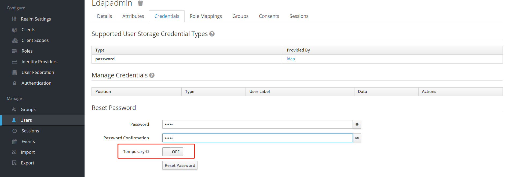
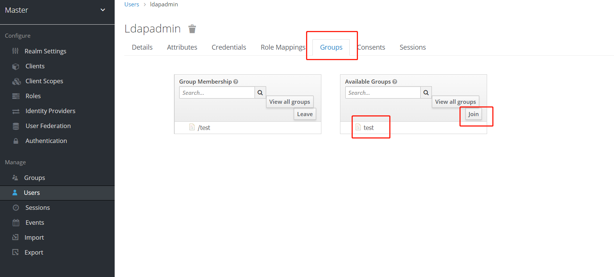
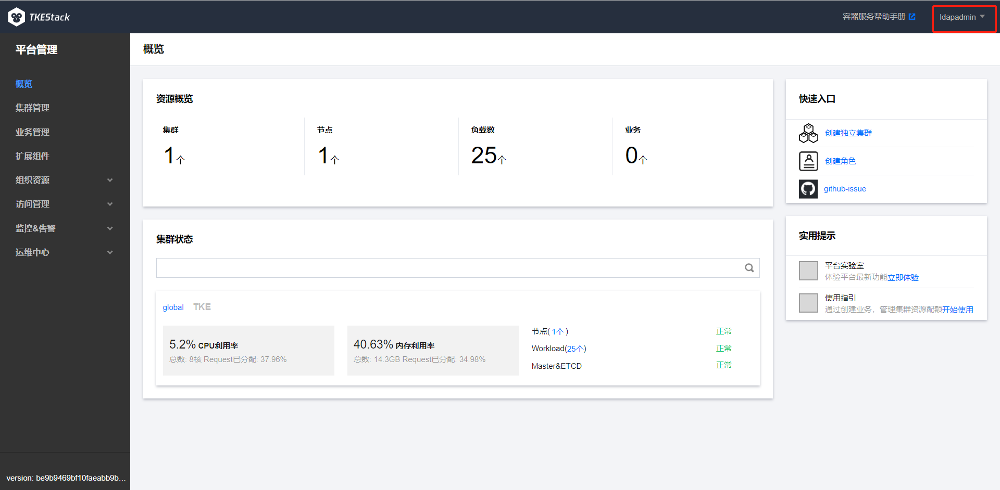

**Author**: LeoRyu

_LDAP 是一个开放的，中立的，工业标准的应用协议，在开发内部网和与互联网程序共享用户、系统、网络、服务和应用的过程中占据了重要地位。本文将介绍 TKEStack中的 tke-auth 组件如何与 LDAP进行集成。_

## 前置要求

本文介绍的内容是建立在已经有一个正常运行的 TKEStack 平台基础上，由于集成 LDAP 功能在当前已 release 版本中存在问题，这里建议安装 daily build 版本的 tke-installer 安装 TKEStack：`version=be9b9469bf10faeabb9ba60a8591aad2b5f73f41 wget https://tke-release-1251707795.cos.ap-guangzhou.myqcloud.com/tke-installer-linux-amd64-$version.run{,.sha256} && sha256sum --check --status tke-installer-linux-amd64-$version.run.sha256 && chmod +x tke-installer-linux-amd64-$version.run && ./tke-installer-linux-amd64-$version.run`。

本文介绍的内容需要通过 helm 安装一些实验用途的组件，可参考[安装Helm](https://helm.sh/zh/docs/intro/install/)进行安装。

## 安装 openldap

这里如果有现成的 LDAP 服务器可以跳过此步骤。

首先通过以下命令下载 openldap 的 chart：

```sh
wget https://tke-release-1251707795.cos.ap-guangzhou.myqcloud.com/charts/openldap-1.2.7.tgz
```

将下面的 yaml 存储到`values-openldap.yaml`：

```yaml
replicaCount: 1
image:
  repository: osixia/openldap
  tag: 1.2.4
  pullPolicy: IfNotPresent

tls:
  enabled: false
  CA:
    enabled: false
service:
  clusterIP: ""

  ldapPort: 389
  type: ClusterIP

env:
  LDAP_ORGANISATION: "TKEStack Demo"
  LDAP_DOMAIN: "tkestack.io"
  LDAP_BACKEND: "hdb"
  LDAP_TLS: "true"
  LDAP_TLS_ENFORCE: "false"
  LDAP_REMOVE_CONFIG_AFTER_SETUP: "true"
  LDAP_READONLY_USER: "true"
  LDAP_READONLY_USER_USERNAME: readonly
  LDAP_READONLY_USER_MASSWORD: password

# Default Passwords to use, stored as a secret. If unset, passwords are auto-generated.
# You can override these at install time with
# helm install openldap --set openldap.adminPassword=<passwd>,openldap.configPassword=<passwd>
adminPassword: admin
configPassword: admin

# Custom openldap configuration files used to override default settings
customLdifFiles:
  0-initial-ous.ldif: |-
    dn: ou=People,dc=tkestack,dc=io
    objectClass: organizationalUnit
    ou: People

    dn: ou=Group,dc=tkestack,dc=io
    objectClass: organizationalUnit
    ou: Group
```
这里默认使用 admin 作为 ldap 服务器的访问凭证，运行下面命令安装 openldap：

```sh
helm install openldap openldap-1.2.7.tgz  --values values-openldap.yaml
```

安装成功后通过下面命令获取到 openldap 的服 ClusterIP 地址：

```sh
kubectl get service openldap
```
然后通过 ldapsearch 命令查询 ldap 服务是否正常：

```sh
ldapsearch -x -H ldap://{cluster_ip}:389 -b dc=tkestack,dc=io -D "cn=admin,dc=tkestack,dc=io" -w {your password default is admin}
```

如果一切正常将会得到类似下面的返回内容：

```sh
# extended LDIF
#
# LDAPv3
# base <dc=tkestack,dc=io> with scope subtree
# filter: (objectclass=*)
# requesting: ALL
#

# tkestack.io
dn: dc=tkestack,dc=io
objectClass: top
objectClass: dcObject
objectClass: organization
o: TKEStack Demo
dc: tkestack
...
```

## 使用 keycloak 管理 LDAP

本节将介绍通过 keycloak 图形界面控制 LDAP。首先下载 keycloak 的chart：

```sh
wget https://tke-release-1251707795.cos.ap-guangzhou.myqcloud.com/charts/keycloak-16.1.0.tgz
```
现在完毕后将下面内容存储到 `values-keycloak.yaml`：

```yaml
# Default values for keycloak.
# This is a YAML-formatted file.
# Declare variables to be passed into your templates.

replicaCount: 1

image:
  repository: docker.io/jboss/keycloak
  pullPolicy: IfNotPresent
  # Overrides the image tag whose default is the chart appVersion.
  tag: "16.1.0"

service:
  type: NodePort
  port: 8443
  nodePort: 30443
```

这里默认使用 admin 作为 keycloak 的用户名密码。然后通过 helm 安装 keycloak：

```sh
helm install keycloak  keycloak-16.1.0.tgz --values values-keycloak.yaml
```

安装成功后可以通过`https://{keycloak 所在 node IP}:30443`访问 keycloak 页面：


然后进入 admin 登录界面使用 keycloak admin 用户登录：


成功登录 keycloak 之后我们可以在`User Federation
`中配置管理 LDAP：


在配置过程中我们可以通过`Test connection`和`Test authentication`测试配置是否有效。完成配置和我们就可以在 keycloak 中创建用户并同步到 LDAP 服务器。这里通过`Users`中添加用户：


这里注意一定要配置`Email`信息。创建成功后我们在用户的`Credentials` 中配置用户密码：



如果一切正常，此时用户信息应该已经同步到了 LDAP 服务器，我们可以通过以下命令进行检查：

```sh
ldapsearch -x -H ldap://{cluster_ip}:389 -b dc=tkestack,dc=io -D "cn=admin,dc=tkestack,dc=io" -w {your password default is admin}
```
我们在返回结果中可以得到该用户信息：

```sh
...
# ldapadmin, People, tkestack.io
dn: uid=ldapadmin,ou=People,dc=tkestack,dc=io
uid: ldapadmin
objectClass: inetOrgPerson
objectClass: organizationalPerson
mail: ldapadmin@example.com
sn:: IA==
cn:: IA==
userPassword:: YWRtaW4=
...
```

除了用户信息，我们也可以通过 keycloak 添加 group 信息到 LDAP，这里我们需要在`LDAP`的`Mappers`中创建一个 group mapper：


创建成功后我们可以将已经创建的用户添加到此 group 中：



再执行下列命令：

```sh
ldapsearch -x -H ldap://{cluster_ip}:389 -b dc=tkestack,dc=io -D "cn=admin,dc=tkestack,dc=io" -w {your password default is admin}
```

将得到我们刚刚添加的 group 信息：

```sh
...
# test, Group, tkestack.io
dn: cn=test,ou=Group,dc=tkestack,dc=io
objectClass: groupOfNames
cn: test
member: cn=empty-membership-placeholder
member: uid=ldapadmin,ou=People,dc=tkestack,dc=io
...
```

## tke-auth 与 LDAP 的集成

本节将介绍 tke-auth 如何与 LDAP 进行集成，并通过 LDAP 用户登录管理 TKEStack 平台。

首先我们将 TKEStack 默认的 identityprovider 进行备份：

```sh
kubectl get identityproviders.auth.tkestack.io default -o yaml > default.identityproviders.bak
```

然后将 LDAP 相关的配置保存到`ldap.json`中：

```json
{
        "host": "openldap.default:389",
        "insecureNoSSL": true,
        "bindDN": "cn=admin,dc=tkestack,dc=io",
        "bindPW": "admin",
        "usernamePrompt": "User name",
        "userSearch": {
                "baseDN": "ou=People,dc=tkestack,dc=io",
                "filter": "(objectClass=organizationalPerson)",
                "username": "uid",
                "idAttr": "DN",
                "emailAttr": "mail",
                "nameAttr": "uid",
                "preferredUsernameAttr": "uid"
        },
        "groupSearch": {
                "baseDN": "ou=Group,dc=tkestack,dc=io",
                "filter": "(objectClass=groupOfNames)",
                "userAttr": "DN",
                "groupAttr": "member",
                "nameAttr": "cn"
        }
}
```

使用该文件创建 ConfigMap：

```sh
kubectl create cm -n tke ldap --from-file ldap.json
```

创建成功后我们需要将此 ConfigMap 加载到 tke-auth-api 组件中：

```sh
kubectl edit -n tke deployments.apps tke-auth-api
```

添加下面的内容：

```yaml
...
        volumeMounts:
	...
        - mountPath: /app/ldap
          name: ldap-volume
      volumes:
      ...
      - configMap:
          defaultMode: 420
          name: ldap
        name: ldap-volume
...
```

修改成功后我们需要修改 tke-auth-api 的 ConfigMap，使得其能够创建识别 ldap identityprovider：

```sh
kubectl edit -n tke cm tke-auth-api
```

添加下面内容到 tke-auth-api.toml 文件中：

```yaml
  tke-auth-api.toml: |
  ....
    [auth]
    # 指定ldap类型的idp
    init_tenant_type = "ldap"
    # tenant id，需要控制global集群需要是default
    init_tenant_id = "default"
    # 预设的特权用户，配置一个ldap中存在的用户
    init_idp_administrators = ["ldapadmin"]
    # ldap 配置路径
    ldap_config_file = "/app/ldap/ldap.json"
  ...
```

修改成功后我们需要删除现有的默认 identityprovider，并重建 tke-auth-api：

```sh
kubectl delete identityproviders.auth.tkestack.io default
kubectl delete pod -n tke tke-auth-api-xxx
```

待重建完成后 ldap 的 identityprovider 将会被自动创建，可以通过下列命令进行验证：


```sh
kubectl get identityproviders.auth.tkestack.io  default -o yaml
```

如果正常我们将得到类似下面的结果：

```sh
apiVersion: auth.tkestack.io/v1
kind: IdentityProvider
metadata:
  creationTimestamp: "2021-12-30T02:51:34Z"
  name: default
  resourceVersion: "808829"
  uid: b8c87fd2-824c-44a5-962e-f821ddfa567c
spec:
  administrators:
  - ldapadmin
  config: '{"host":"openldap.default:389","insecureNoSSL":true,"insecureSkipVerify":false,"startTLS":false,"rootCA":"","clientCert":"","clientKey":"","rootCAData":null,"bindDN":"cn=admin,dc=tkestack,dc=io","bindPW":"admin","usernamePrompt":"User
    name","userSearch":{"baseDN":"ou=People,dc=tkestack,dc=io","filter":"(objectClass=organizationalPerson)","username":"uid","scope":"","idAttr":"DN","emailAttr":"mail","nameAttr":"uid","preferredUsernameAttr":"uid","emailSuffix":""},"groupSearch":{"baseDN":"ou=Group,dc=tkestack,dc=io","filter":"(objectClass=groupOfNames)","scope":"","userAttr":"DN","groupAttr":"member","userMatchers":null,"nameAttr":"cn"}}'
  name: default
  type: ldap
```

此时我们已经完成了 tke-auth 和 LDAP 的集成工作，我们可以通过下面的命令查询 LDAP 的用户和 group：

```sh
kubectl get user --field-selector=spec.tenantID=default
# NAME   CREATED AT
# test   0001-01-01T00:00:00Z
kubectl get group --field-selector=spec.tenantID=default
# NAME        CREATED AT
# ldapadmin   0001-01-01T00:00:00Z
```

此时我们可以使用 LDAP 的用户登录管理 TKEStack：


