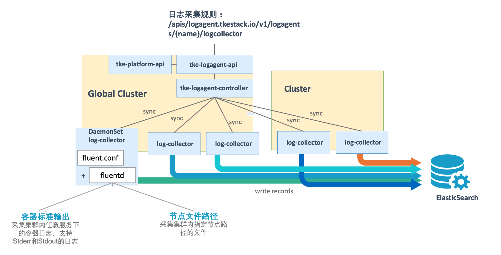
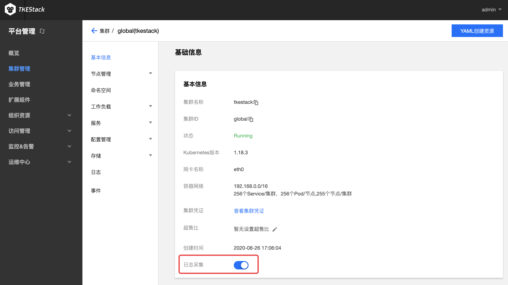
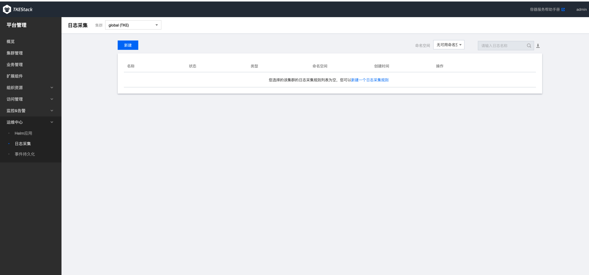
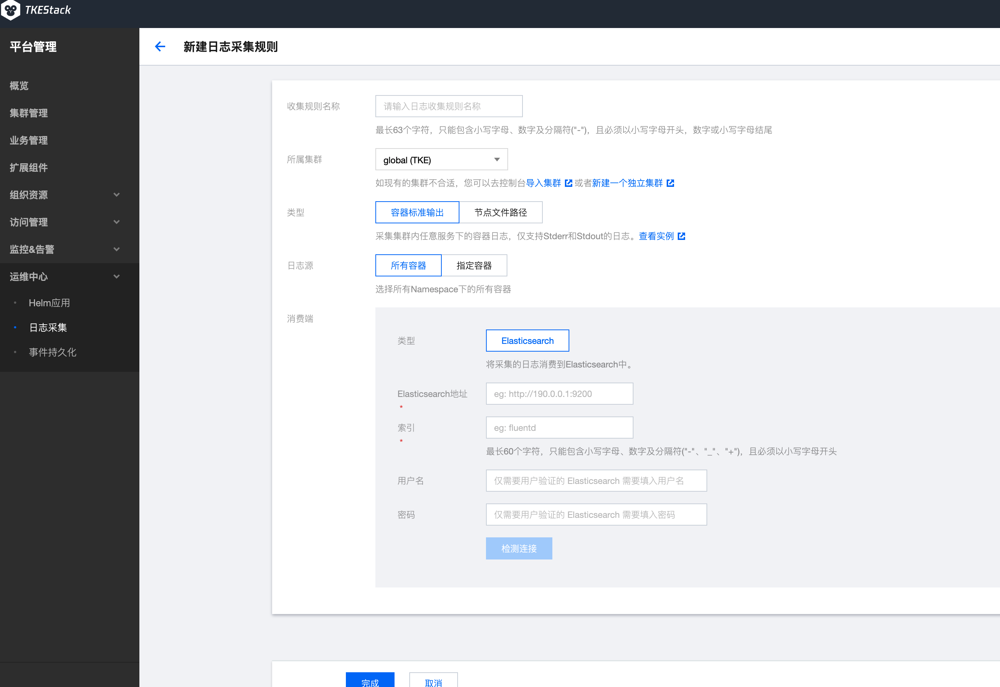
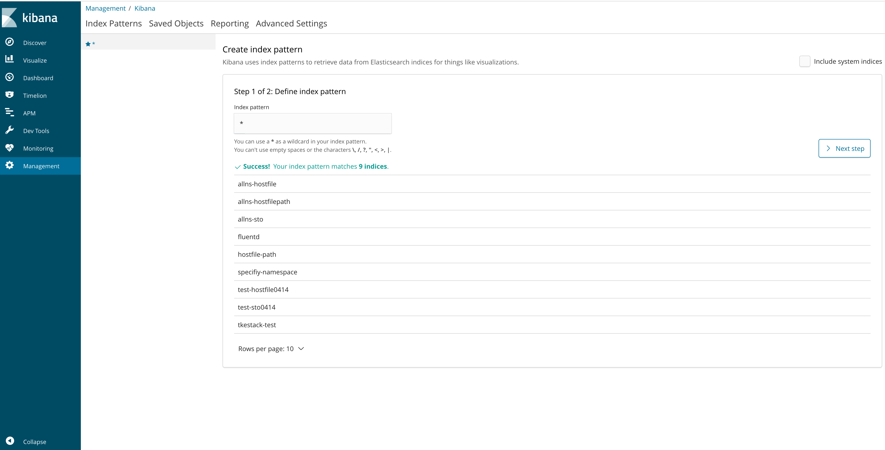
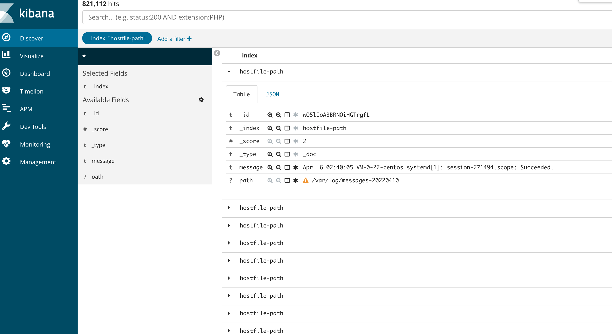

**Author**: wl-chen

[TKEStack](https://github.com/tkestack/tke) 是一个开源项目，它为在生产环境中部署容器的组织提供了一个容器管理平台。TKEStack 让您可以轻松地在任何地方运行 Kubernetes、满足 IT 需求并为 DevOps 团队赋能。
本文将介绍TKEStack中日志功能，包括主要组件及其功能，以及与kibana的对接。

# 日志采集

TKESTack 提供的集群内日志采集功能，支持将集群内服务或集群节点特定路径文件的日志发送至 Elasticsearch 等消费端，支持采集容器标准输出日志以及主机内文件日志。更提供事件持久化、审计等功能，实时记录集群事件及操作日志记录，帮助运维人员存储和分析集群内部资源生命周期、资源调度、异常告警等情况。

日志收集功能需要为每个集群手动开启,集群中开启日志收集功能后，日志收集组件 logagent 会在集群内以 Daemonset 的形式运行。用户可以通过日志收集规则配置日志的采集源和消费端，日志收集 Agent 会从用户配置的采集源进行日志收集，并将日志内容发送至用户指定的消费端。需要注意的是，**使用日志收集功能需要您确认 Kubernetes 集群内节点能够访问日志消费端。**

- **采集容器标准输出日志** ：采集集群内指定**容器的 Stderr 和 Stdout 日志。**，采集到的日志信息将会以 JSON 格式输出到用户指定的消费端，并会自动附加相关的 Kubernetes metadata， 包括容器所属 Pod 的 label 和 annotation 等信息。
- **采集主机内文件日志** ：采集集群内所有节点的指定**主机文件路径的日志**，logagent 会采集集群内所有节点上满足指定路径规则的文件日志，以 JSON 格式输出到用户指定的输出端， 并会附加用户指定的 metadata，包括日志来源文件的路径和用户自定义的 metadata。

> 注意：日志采集对接外部 Elasticsearch，该功能需要额外开启，如下图在集群点击开启“日志采集”服务。

## 使用日志采集服务

### 平台管理侧

  1. 登录 TKEStack
  2. 在【平台管理】控制台，选择 【运维中心】->【日志采集】
  3. 选择相应集群，单击【新建】按钮，如下图所示：
     
  4. 在“新建日志采集”页面填写日志采集信息，如下图所示：
     
     
     + **收集规则名称：** 输入规则名，1～63字符，只能包含小写字母、数字及分隔符("-")，且必须以小写字母开头，数字或小写字母结尾
     
     + **所属集群：** 选择所属集群
     
     + **类型：** 选择采集类型
       + **容器标准输出：** 容器 Stderr 和 Stdout 日志信息采集
         
         + **日志源：** 可以选择所有容器或者某个 Namespace 下的所有容器/工作负载
           + **所有容器：** 所有容器
           + **指定容器：** 某个 Namespace 下的所有容器或者工作负载
       + **节点文件路径：**  收集节点上某个路径下的文件内容
          + **日志源：** 可以采集具体节点内的某个文件路径下的文件内容
             + **收集路径：** 节点上日志收集路径。路径必须以`/`开头和结尾，文件名支持通配符（*）。文件路径和文件名最长支持63个字符
           + **metadata：** key：value 格式，收集的日志会带上 metadata 信息上报给消费端
       
     + **消费端：** 消费端类型目前只支持Elasticsearch
       + **Elasticsearch：** 
         + **Elasticsearch 地址：** ES 地址，如：http://190.0.0.1:200
         
           > 注意：当前只支持未开启用户登录认证的 ES 集群
         
         + **索引：** ES索引，最长60个字符，只能包含小写字母、数字及分隔符("-"、"_"、"+")，且必须以小写字母开头
  5. 单击【完成】按钮

## Elasticsearch对接Kinada
  
  1. Kibana的deployment中配置Elasticsearch服务地址的环境变量，及访问Elasticsearch服务的用户名密码(kibana7.0.0及以上版本)
  > env:
  >     - name: "ELASTICSEARCH_HOSTS"
  >       value: "http://192.168.0.73:9200"
  >     - name: "ELASTICSEARCH_USERNAME"
  >       value: "kibana"
  >     - name: "ELASTICSEARCH_PASSWORD"
  >       value: "test@123"
  > Kibana 7.0.0以下版本elasticsearch地址配置成ELASTICSEARCH_URL

  2. Kibana中index pattern推荐设为*，以自动匹配所有Elasticsearch中的indices,如下图所示
  
  > 参考： https://www.elastic.co/guide/cn/kibana/current/docker.html

  3. Kibana中根据索引查看数据
  